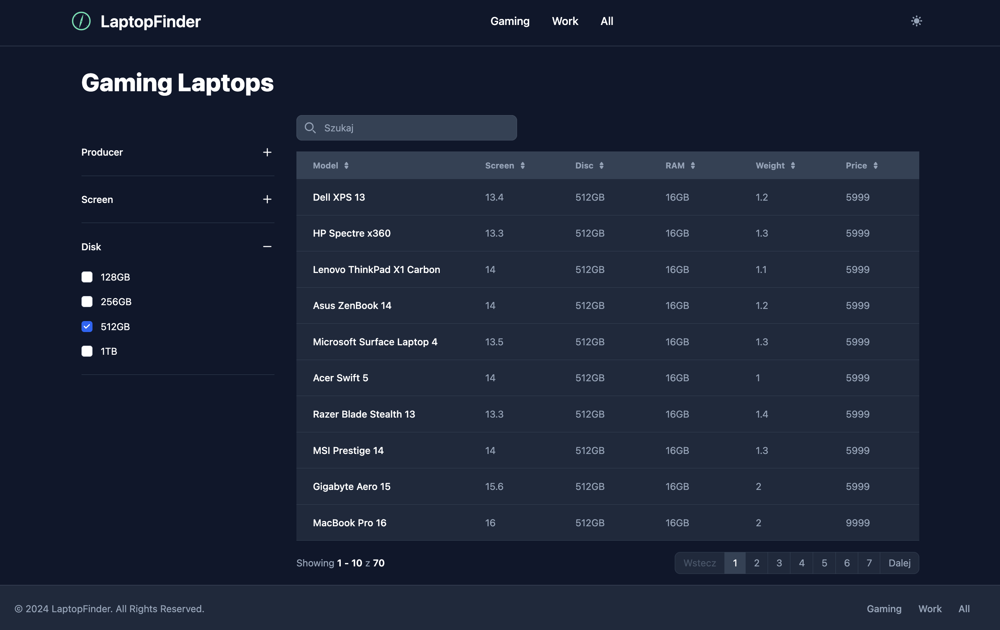

# LaptopFinder
A small unfinished side project built to explore HTMX.

# Features
- Interactive table with filters, sorting, pagination and search - all rendered server-side
- No page reloads (AJAX, powered by HTMX)
- Plain JavaScript used only for for basic interactivity like accordions
- Responsive design with off-canvas filters
- Light and dark theme

# UI
